# Ra Ecommerce Data Warehouse - Data Flow Diagram

This document contains Mermaid diagrams showing the data flow through the Ra Ecommerce Data Warehouse from sources through staging, integration, and warehouse layers.

## Overall Data Flow Architecture

```mermaid
graph TD
    %% Data Sources
    subgraph Sources ["🔌 Data Sources"]
        S1[Shopify<br/>Orders, Customers, Products]
        S2[Google Analytics 4<br/>Events, Sessions]
        S3[Google Ads<br/>Campaigns, Performance]
        S4[Facebook Ads<br/>Campaigns, Performance]
        S5[Pinterest Ads<br/>Campaigns, Performance]
        S6[Klaviyo<br/>Email Campaigns, Events]
        S7[Instagram Business<br/>Posts, Engagement]
    end

    %% Staging Layer
    subgraph Staging ["🧹 Staging Layer"]
        ST1[stg_shopify_ecommerce__*<br/>4 models]
        ST2[stg_ga4_events__*<br/>3 models]
        ST3[stg_google_ads__*<br/>4 models]
        ST4[stg_facebook_ads__*<br/>4 models]
        ST5[stg_pinterest_ads__*<br/>3 models]
        ST6[stg_klaviyo__*<br/>3 models]
        ST7[stg_instagram_business__*<br/>2 models]
    end

    %% Integration Layer
    subgraph Integration ["⚙️ Integration Layer"]
        INT1[int_customers<br/>Customer metrics & segments]
        INT2[int_orders<br/>Order aggregations]
        INT3[int_products<br/>Product performance]
        INT4[int_sessions<br/>Website sessions]
        INT5[int_events<br/>Website events]
        INT6[int_campaigns<br/>Unified campaigns]
        INT7[int_customer_journey<br/>Attribution analysis]
        INT8[int_email_events<br/>Email engagement]
        INT9[int_email_campaign_performance<br/>Email performance]
        INT10[int_data_pipeline_metadata<br/>Data quality monitoring]
    end

    %% Warehouse Layer
    subgraph Warehouse ["🏢 Warehouse Layer"]
        subgraph Dimensions ["📊 Dimensions"]
            D1[dim_customers<br/>SCD Type 2]
            D2[dim_products<br/>SCD Type 2]
            D3[dim_date<br/>Calendar dimension]
            D4[dim_channels_enhanced<br/>Marketing channels]
            D5[dim_email_campaigns<br/>Email campaigns]
        end
        
        subgraph Facts ["📈 Facts"]
            F1[fact_orders<br/>Order line items]
            F2[fact_sessions<br/>Website sessions]
            F3[fact_events<br/>User interactions]
            F4[fact_customer_journey<br/>Multi-touch attribution]
            F5[fact_marketing_performance<br/>Ad performance]
            F6[fact_email_marketing<br/>Email engagement]
            F7[fact_social_posts<br/>Social content]
            F8[fact_data_quality<br/>Pipeline health]
        end
    end

    %% Data Flow Connections
    S1 --> ST1
    S2 --> ST2
    S3 --> ST3
    S4 --> ST4
    S5 --> ST5
    S6 --> ST6
    S7 --> ST7

    ST1 --> INT1
    ST1 --> INT2
    ST1 --> INT3
    ST2 --> INT4
    ST2 --> INT5
    ST3 --> INT6
    ST4 --> INT6
    ST5 --> INT6
    ST2 --> INT7
    ST1 --> INT7
    ST6 --> INT8
    ST6 --> INT9
    ST1 --> INT10
    ST2 --> INT10
    ST3 --> INT10
    ST4 --> INT10
    ST5 --> INT10
    ST6 --> INT10
    ST7 --> INT10

    INT1 --> D1
    INT1 --> F1
    INT2 --> F1
    INT3 --> D2
    INT3 --> F1
    INT4 --> F2
    INT5 --> F3
    INT6 --> F5
    INT7 --> F4
    INT8 --> F6
    INT9 --> D5
    INT9 --> F6
    INT10 --> F8

    %% Cross-references
    D3 --> F1
    D3 --> F2
    D3 --> F3
    D3 --> F4
    D3 --> F5
    D3 --> F6
    D3 --> F7
    D3 --> F8
    D4 --> F2
    D4 --> F4
    D4 --> F5

    classDef sourceStyle fill:#e1f5fe,stroke:#01579b,stroke-width:2px
    classDef stagingStyle fill:#f3e5f5,stroke:#4a148c,stroke-width:2px
    classDef integrationStyle fill:#e8f5e8,stroke:#1b5e20,stroke-width:2px
    classDef warehouseStyle fill:#fff3e0,stroke:#e65100,stroke-width:2px
    classDef dimensionStyle fill:#fff8e1,stroke:#f57f17,stroke-width:2px
    classDef factStyle fill:#fce4ec,stroke:#ad1457,stroke-width:2px

    class S1,S2,S3,S4,S5,S6,S7 sourceStyle
    class ST1,ST2,ST3,ST4,ST5,ST6,ST7 stagingStyle
    class INT1,INT2,INT3,INT4,INT5,INT6,INT7,INT8,INT9,INT10 integrationStyle
    class D1,D2,D3,D4,D5 dimensionStyle
    class F1,F2,F3,F4,F5,F6,F7,F8 factStyle
```

## Detailed Integration Layer Flow

## Detailed Warehouse Layer Flow

## Data Quality and Monitoring Flow

## Key Data Flow Principles

### 1. **Layered Architecture**
- **Staging**: Clean, standardize, and validate raw data
- **Integration**: Apply business logic and create cross-source relationships
- **Warehouse**: Dimensional modeling optimized for analytics

### 2. **Source-Agnostic Integration**
- Multiple ad platforms unified into `int_campaigns`
- Email events standardized across campaign types
- Attribution analysis combines all touchpoints

### 3. **Comprehensive Monitoring**
- Every layer tracked for row counts and data flow
- Test pass rates monitored at each stage
- Quality scores calculated for pipeline health

### 4. **Dimensional Modeling**
- SCD Type 2 for customers and products
- Conformed dimensions across fact tables
- Star schema optimized for BI tools

### 5. **Attribution & Journey Analysis**
- Multi-touch attribution with configurable models
- Customer journey complexity classification
- Cross-channel conversion analysis