# Ra Ecommerce Data Warehouse - Data Flow Diagram

This document contains Mermaid diagrams showing the data flow through the Ra Ecommerce Data Warehouse from sources through staging, integration, and warehouse layers using actual BigQuery table names.

## Overall Data Flow Architecture


## Detailed Staging Layer Tables


## Detailed Integration Layer Flow

```mermaid
graph TD
    %% Staging Inputs
    subgraph StagingInputs ["🧹 Staging Tables"]
        ST_SHOP[Shopify Tables<br/>9 staging tables]
        ST_GA4[GA4 Event Tables<br/>9 event types]
        ST_ADS[Ad Platform Tables<br/>Google, Facebook, Pinterest]
        ST_EMAIL[Klaviyo Tables<br/>Campaigns, Events, Persons]
        ST_SOCIAL[Instagram Tables<br/>Media, Users]
    end

    %% Integration Models
    subgraph CoreIntegration ["⚙️ Core Integration"]
        INT_CUST[int_customers<br/>- Customer segments<br/>- LTV calculations<br/>- Activity metrics]
        INT_ORD[int_orders<br/>- Order aggregations<br/>- Sequence analysis<br/>- Order classifications]
        INT_PROD[int_products<br/>- Performance metrics<br/>- Revenue tiers<br/>- Sales velocity]
        INT_SESS[int_sessions & int_ga4_sessions<br/>- Session metrics<br/>- Conversion indicators<br/>- Engagement scoring]
        INT_EVENTS[int_events<br/>- Event standardization<br/>- Business context]
    end

    subgraph MarketingIntegration ["📢 Marketing Integration"]
        INT_CAMP[int_campaigns<br/>- Multi-platform unification<br/>- Performance tiers<br/>- Efficiency scoring]
        INT_JOURNEY[int_customer_journey<br/>- Attribution weights<br/>- Journey complexity<br/>- Conversion paths]
        INT_EMAIL[int_email_events &<br/>int_klaviyo_email_events<br/>- Event unification<br/>- Customer context]
        INT_EMAIL_PERF[int_email_campaign_performance &<br/>int_klaviyo_campaign_performance<br/>- Aggregated metrics<br/>- Performance tiers]
        INT_CHAN[int_channels_enhanced &<br/>int_channels_working<br/>- Channel mapping<br/>- Attribution setup]
    end

    subgraph OperationalIntegration ["📦 Operational Integration"]
        INT_CAT[int_categories_simple<br/>- Category hierarchy<br/>- Product groupings]
        INT_INV[int_inventory_simple<br/>- Stock levels<br/>- Availability status]
        INT_METRICS[int_customer_metrics_simple<br/>- RFM calculations<br/>- Customer KPIs]
    end

    subgraph QualityIntegration ["🔍 Quality Integration"]
        INT_PIPELINE[int_data_pipeline_metadata<br/>- Flow percentages<br/>- Row counts by layer<br/>- Table counts]
    end

    %% Connections from Staging to Integration
    ST_SHOP --> INT_CUST
    ST_SHOP --> INT_ORD
    ST_SHOP --> INT_PROD
    ST_SHOP --> INT_JOURNEY
    ST_SHOP --> INT_CAT
    ST_SHOP --> INT_INV
    ST_SHOP --> INT_METRICS
    ST_SHOP --> INT_CHAN
    
    ST_GA4 --> INT_SESS
    ST_GA4 --> INT_EVENTS
    ST_GA4 --> INT_JOURNEY
    ST_GA4 --> INT_CHAN
    
    ST_ADS --> INT_CAMP
    
    ST_EMAIL --> INT_EMAIL
    ST_EMAIL --> INT_EMAIL_PERF
    
    ST_SHOP --> INT_PIPELINE
    ST_GA4 --> INT_PIPELINE
    ST_ADS --> INT_PIPELINE
    ST_EMAIL --> INT_PIPELINE
    ST_SOCIAL --> INT_PIPELINE

    %% Cross-integration dependencies
    INT_CUST --> INT_JOURNEY
    INT_ORD --> INT_JOURNEY
    INT_SESS --> INT_JOURNEY

    classDef stagingStyle fill:#f3e5f5,stroke:#4a148c,stroke-width:2px
    classDef coreStyle fill:#e8f5e8,stroke:#1b5e20,stroke-width:2px
    classDef marketingStyle fill:#e3f2fd,stroke:#0d47a1,stroke-width:2px
    classDef operationalStyle fill:#fff9c4,stroke:#f9a825,stroke-width:2px
    classDef qualityStyle fill:#fff3e0,stroke:#e65100,stroke-width:2px

    class ST_SHOP,ST_GA4,ST_ADS,ST_EMAIL,ST_SOCIAL stagingStyle
    class INT_CUST,INT_ORD,INT_PROD,INT_SESS,INT_EVENTS coreStyle
    class INT_CAMP,INT_JOURNEY,INT_EMAIL,INT_EMAIL_PERF,INT_CHAN marketingStyle
    class INT_CAT,INT_INV,INT_METRICS operationalStyle
    class INT_PIPELINE qualityStyle
```



## Detailed Warehouse Layer Flow

```mermaid
graph TD
    %% Integration Inputs
    subgraph IntegrationInputs ["⚙️ Integration Tables"]
        INT_CUST[int_customers]
        INT_ORD[int_orders]
        INT_PROD[int_products]
        INT_SESS[int_sessions/int_ga4_sessions]
        INT_EVENTS[int_events]
        INT_CAMP[int_campaigns]
        INT_JOURNEY[int_customer_journey]
        INT_EMAIL[int_email_events]
        INT_EMAIL_PERF[int_email_campaign_performance]
        INT_CHAN[int_channels_enhanced]
        INT_CAT[int_categories_simple]
        INT_INV[int_inventory_simple]
        INT_METRICS[int_customer_metrics_simple]
        INT_PIPELINE[int_data_pipeline_metadata]
    end

    %% Warehouse Dimensions
    subgraph Dimensions ["📊 Dimension Tables"]
        DIM_CUST[dim_customers<br/>- SCD Type 2<br/>- 40+ attributes<br/>- Segmentation]
        DIM_PROD[dim_products<br/>- Product master<br/>- Performance metrics]
        DIM_DATE[dim_date<br/>- Calendar attributes<br/>- Fiscal calendar]
        DIM_CHAN[dim_channels<br/>- Channel mapping<br/>- Attribution setup]
        DIM_METRICS[dim_customer_metrics<br/>- RFM segments<br/>- Predictive scores]
        DIM_CAT[dim_categories<br/>- Category hierarchy]
        DIM_SOCIAL[dim_social_content<br/>- Content attributes]
    end

    %% Warehouse Facts
    subgraph Facts ["📈 Fact Tables"]
        FACT_ORD[fact_orders<br/>- Order header grain<br/>- 68 columns<br/>- Comprehensive metrics]
        FACT_ITEMS[fact_order_items<br/>- Line item grain<br/>- Product detail]
        FACT_SESS[fact_sessions<br/>- Session grain<br/>- Engagement metrics]
        FACT_EVENTS[fact_events<br/>- Event grain<br/>- User interactions]
        FACT_JOURNEY[fact_customer_journey<br/>- Attribution analysis<br/>- Multi-touch models]
        FACT_MARKETING[fact_marketing_performance<br/>- Daily campaign metrics<br/>- Cross-platform]
        FACT_EMAIL[fact_email_marketing<br/>- Email event grain<br/>- Engagement tracking]
        FACT_SOCIAL[fact_social_posts<br/>- Post performance<br/>- Engagement metrics]
        FACT_INV[fact_inventory<br/>- Daily snapshots<br/>- Stock levels]
        FACT_SPEND[fact_ad_spend<br/>- Daily ad costs<br/>- Budget tracking]
        FACT_ATTR[fact_ad_attribution<br/>- Conversion attribution<br/>- Click/view through]
        FACT_QUALITY[fact_data_quality<br/>- Pipeline monitoring<br/>- Quality scores]
    end

    %% Integration to Dimensions
    INT_CUST --> DIM_CUST
    INT_PROD --> DIM_PROD
    INT_CHAN --> DIM_CHAN
    INT_CAT --> DIM_CAT
    INT_METRICS --> DIM_METRICS

    %% Integration to Facts
    INT_CUST --> FACT_ORD
    INT_ORD --> FACT_ORD
    INT_PROD --> FACT_ORD
    INT_PROD --> FACT_ITEMS
    INT_SESS --> FACT_SESS
    INT_EVENTS --> FACT_EVENTS
    INT_JOURNEY --> FACT_JOURNEY
    INT_CAMP --> FACT_MARKETING
    INT_CAMP --> FACT_SPEND
    INT_CAMP --> FACT_ATTR
    INT_EMAIL --> FACT_EMAIL
    INT_EMAIL_PERF --> FACT_EMAIL
    INT_INV --> FACT_INV
    INT_PIPELINE --> FACT_QUALITY

    %% Dimensional Relationships
    DIM_CUST -.-> FACT_ORD
    DIM_CUST -.-> FACT_ITEMS
    DIM_CUST -.-> FACT_JOURNEY
    DIM_CUST -.-> FACT_ATTR
    DIM_PROD -.-> FACT_ITEMS
    DIM_PROD -.-> FACT_INV
    DIM_DATE -.-> "All Facts"
    DIM_CHAN -.-> FACT_ORD
    DIM_CHAN -.-> FACT_SESS
    DIM_CHAN -.-> FACT_JOURNEY
    DIM_CHAN -.-> FACT_MARKETING
    DIM_CHAN -.-> FACT_SPEND
    DIM_CHAN -.-> FACT_ATTR
    DIM_SOCIAL -.-> FACT_SOCIAL

    classDef integrationStyle fill:#e8f5e8,stroke:#1b5e20,stroke-width:2px
    classDef dimensionStyle fill:#fff8e1,stroke:#f57f17,stroke-width:2px
    classDef factStyle fill:#fce4ec,stroke:#ad1457,stroke-width:2px

    class INT_CUST,INT_ORD,INT_PROD,INT_SESS,INT_EVENTS,INT_CAMP,INT_JOURNEY,INT_EMAIL,INT_EMAIL_PERF,INT_CHAN,INT_CAT,INT_INV,INT_METRICS,INT_PIPELINE integrationStyle
    class DIM_CUST,DIM_PROD,DIM_DATE,DIM_CHAN,DIM_METRICS,DIM_CAT,DIM_SOCIAL dimensionStyle
    class FACT_ORD,FACT_ITEMS,FACT_SESS,FACT_EVENTS,FACT_JOURNEY,FACT_MARKETING,FACT_EMAIL,FACT_SOCIAL,FACT_INV,FACT_SPEND,FACT_ATTR,FACT_QUALITY factStyle
```

## Data Quality and Monitoring Flow

```mermaid
graph LR
    %% Data Sources
    subgraph Sources ["📥 Sources"]
        SRC[Source Tables<br/>Raw Data from<br/>7 platforms]
    end

    %% Pipeline Stages with BigQuery Datasets
    subgraph Pipeline ["🔄 Data Pipeline"]
        STG[Staging Layer<br/>analytics_ecommerce_staging<br/>18 table groups]
        INT[Integration Layer<br/>analytics_ecommerce_integration<br/>18 tables]
        WH[Warehouse Layer<br/>analytics_ecommerce_ecommerce<br/>7 dims + 12 facts]
    end

    %% Monitoring
    subgraph Monitoring ["📊 Data Quality Monitoring"]
        META[int_data_pipeline_metadata<br/>- Row counts by layer<br/>- Flow percentages<br/>- Table counts]
        QUALITY[fact_data_quality<br/>- Test pass rates<br/>- Completeness scores<br/>- Health ratings<br/>- Pipeline efficiency]
    end

    %% Flow with Monitoring
    SRC --> STG
    STG --> INT
    INT --> WH
    
    SRC -.-> META
    STG -.-> META
    INT -.-> META
    WH -.-> META
    
    META --> QUALITY
    
    %% Feedback Loop
    QUALITY -.-> SRC
    QUALITY -.-> STG
    QUALITY -.-> INT
    QUALITY -.-> WH

    classDef sourceStyle fill:#e1f5fe,stroke:#01579b,stroke-width:2px
    classDef pipelineStyle fill:#f3e5f5,stroke:#4a148c,stroke-width:2px
    classDef monitoringStyle fill:#fff3e0,stroke:#e65100,stroke-width:2px

    class SRC sourceStyle
    class STG,INT,WH pipelineStyle
    class META,QUALITY monitoringStyle
```



## BigQuery Dataset Organization

### **analytics_ecommerce_staging**
- **Purpose**: Clean and standardize raw data
- **Tables**: 18+ staging tables across 7 data sources
- **Naming**: `stg_{source}__{entity}`
- **Key Features**: Data type casting, field renaming, basic calculations

### **analytics_ecommerce_integration**
- **Purpose**: Business logic and cross-source integration
- **Tables**: 18 integration tables
- **Naming**: `int_{business_concept}`
- **Key Features**: Calculated metrics, segmentation, attribution prep

### **analytics_ecommerce_ecommerce**
- **Purpose**: Analytics-ready dimensional model
- **Tables**: 7 dimensions + 12 fact tables
- **Naming**: `dim_{entity}` and `fact_{metric}`
- **Key Features**: SCD Type 2, conformed dimensions, comprehensive facts

## Key Data Flow Principles

### 1. **Layered Architecture**
- **Staging**: Clean, standardize, and validate raw data
- **Integration**: Apply business logic and create cross-source relationships
- **Warehouse**: Dimensional modeling optimized for analytics

### 2. **Source-Agnostic Integration**
- Multiple ad platforms unified into `int_campaigns`
- Email events standardized across campaign types
- Attribution analysis combines all touchpoints

### 3. **Comprehensive Monitoring**
- Every layer tracked for row counts and data flow
- Test pass rates monitored at each stage
- Quality scores calculated for pipeline health

### 4. **Dimensional Modeling**
- SCD Type 2 for customers (tracking changes over time)
- Conformed dimensions across fact tables
- Star schema optimized for BI tools

### 5. **Attribution & Journey Analysis**
- Multi-touch attribution with configurable models
- Customer journey complexity classification
- Cross-channel conversion analysis